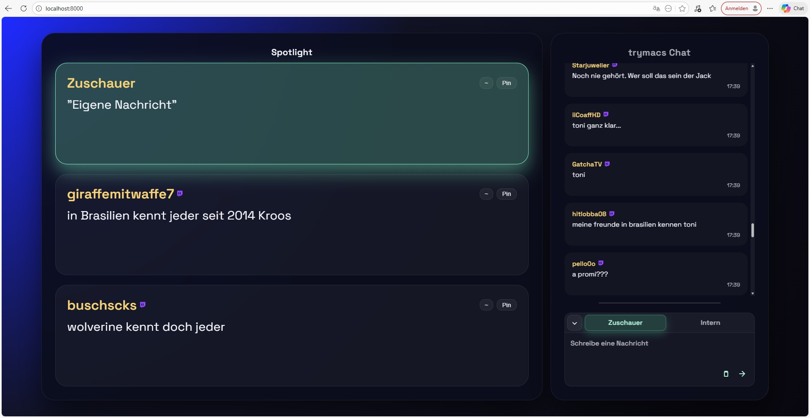

# ChatSpotlight

A FastAPI + WebSocket service that ingests a Twitch channel and drives a shared, show-friendly spotlight queue. Moderators can pin, rumble, and curate custom messages; the audience sees a synchronized spotlight across every connected browser.

## Preview


## Features
- Twitch IRC ingestion with emote rendering, short rolling history, and a capped outbound command queue so custom messages can also be sent to Twitch chat.
- Moderator-gated controls (highlight, clear, pin/unpin, rumble, custom send) using a session cookie plus `X-Session-Token` header; the password is stored in [app/config/password.txt](app/config/password.txt).
- Spotlight queue with three slots, pinning, rumble alerts, and visual states for highlighted or custom-sent messages.
- In-browser composer with role presets (“Viewer”, “Internal”), clipboard paste, and a confirmation modal that can spotlight and/or post to Twitch.
- Full localization (English and German) with a language picker in Settings; defaults to German.
- Mobile-friendly, responsive UI with auto-scroll, long-message compaction, and reconnect handling.
- Fake chat generator switch for offline demos.

## Quick Start
1. **Python environment**
   ```bash
   python -m venv .venv
   .\.venv\Scripts\activate    # Windows
   source .venv/bin/activate   # Linux/macOS  pip install -r requirements.txt
   ```

2. **Configure Twitch + password**
   - Copy the examples in `app/config/` to the real files and fill them in:
     - [app/config/username.txt](app/config/username.txt) — bot username
     - [app/config/oauth_token.txt](app/config/oauth_token.txt) — OAuth token (with or without the `oauth:` prefix)
     - [app/config/channel.txt](app/config/channel.txt) — channel to join
     - [app/config/password.txt](app/config/password.txt) — moderator password for protected actions
   - Optional: set `USE_FAKE_STREAM = True` in [app/main.py](app/main.py) to demo without Twitch.

3. **Run the server**
   ```bash
   uvicorn app.main:app --reload
   ```

4. **Open the UI**
   Visit http://localhost:8000/ in one or more browsers. Everyone shares the same spotlight state.

## Using the UI
- Click any chat message to spotlight it. Click it again (from the queue) to clear, or use the “Pin/Unpin” controls per slot.
- “~” triggers a rumble animation on a slot; the action also broadcasts to other viewers.
- Open the composer via “Compose message”; submit with Enter. A confirmation modal lets you toggle Spotlight and Twitch posting (Twitch is available for the “Viewer” role and uses the bot account).
- Use the gear icon → Settings to switch the UI language (English/German).
- Moderator actions prompt for the password once per browser session; a session cookie plus `X-Session-Token` keep it active for 12h.
- Emotes render inline in chat and spotlight. Long texts auto-compact; chat auto-scrolls unless you scroll up.

## API / Endpoints
- WebSocket: `/ws/chat`. Sends history, live chat, highlight queue, and rumble events.
- REST: `/api/channel` (channel + bot name), `/api/session` (POST password → session token cookie), `/api/custom-message` (POST text/user with optional `spotlight` and `twitch` booleans; requires auth).

## Configuration Notes (edit [app/main.py](app/main.py))
- `HISTORY_LIMIT` (chat history fan-out), `TOTAL_QUEUE_SLOTS` (spotlight slots), `IRC_MESSAGE_LIMIT` (outbound Twitch length guard).
- `SESSION_TTL_SECONDS`, `SESSION_COOKIE`, `SESSION_HEADER`, `SECURE_COOKIES` (auth session handling).
- `USE_FAKE_STREAM`, `FAKE_CHANNEL_NAME` for offline demos.

## Running Behind Nginx
**Why**: Terminate TLS, serve from a sub-path (e.g., `/letsplay/`), and keep WebSocket upgrades stable while the Uvicorn server stays on `127.0.0.1:8000`.

**Steps**:
1) Start Uvicorn locally: `uvicorn app.main:app --host 127.0.0.1 --port 8000`.
2) Add these locations to your Nginx site config (replace the server block paths as needed):

```
   location /letsplay/ {
      proxy_pass http://127.0.0.1:8000/;
      proxy_http_version 1.1;

      proxy_set_header Upgrade $http_upgrade;
      proxy_set_header Connection "upgrade";

      proxy_set_header Host $host;
      proxy_set_header X-Real-IP $remote_addr;
      proxy_set_header X-Forwarded-For $proxy_add_x_forwarded_for;
      proxy_set_header X-Forwarded-Proto $scheme;
   }

   location /ws/chat {
      proxy_pass http://127.0.0.1:8000/ws/chat;
      proxy_http_version 1.1;

      proxy_set_header Upgrade $http_upgrade;
      proxy_set_header Connection "upgrade";

      proxy_set_header Host $host;
      proxy_set_header X-Real-IP $remote_addr;
      proxy_set_header X-Forwarded-For $proxy_add_x_forwarded_for;
      proxy_set_header X-Forwarded-Proto $scheme;
   }
```

Keep `proxy_http_version 1.1` and the `Upgrade/Connection` headers so WebSocket upgrades succeed. If you proxy under a sub-path like `/letsplay/`, mirror it for the WebSocket location (`/letsplay/ws/chat`).

## How It Works
- On startup, Twitch IRC connects and streams messages (or the fake generator runs). Parsed lines become JSON payloads stored in a deque-backed history and lookup map.
- New WebSocket clients immediately receive chat history plus the current highlight queue; further changes broadcast in real time.
- The frontend in [app/static/index.html](app/static/index.html) manages the queue UI, composer, auth modal, rumble, and emote-aware rendering.
